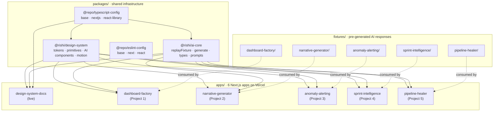

# AI Portfolio

> Five AI-native portfolio projects anchored to real enterprise SaaS data work.
> Built on Next.js + Vercel with a shared design system. Designed to complete the Senior BI Engineer → Data / Analytics Engineer transition.

**Author**: Rishikesh Gundla — [rishikeshgundla.com](https://rishikeshgundla.com)
**Status**: Phase 1 · Week 1 complete (44 / 98 tasks · 44.9%)
**Live demo**: [ai-portfolio-design-system-docs.vercel.app](https://ai-portfolio-design-system-docs.vercel.app)
**Plan**: [docs/master-plan.md](./docs/master-plan.md) · [docs/plan.html](./docs/plan.html) (interactive)

---

## The Five Projects

| # | Project | What it does | Status | Live |
|---|---------|--------------|--------|------|
| 0 | [Design System Docs](./apps/design-system-docs/) | Showcase of tokens, primitives, AI components | **Live** | [link](https://ai-portfolio-design-system-docs.vercel.app) |
| 1 | Instant Analytics Dashboard Factory | Pick a sample dataset → streaming AI profiling → interactive dashboard | Not started | — |
| 2 | Dashboard-to-Deck Narrative Generator | Sample dashboard PDF → AI narrative → polished PPTX | Not started | — |
| 3 | Smart Metric Anomaly Alerting | Curated anomalies → AI root-cause narration with correlation analysis | Not started | — |
| 4 | AI Sprint Intelligence Dashboard | Synthetic sprints → team + individual KPIs → AI meeting brief | Not started | — |
| 5 | AI Pipeline Debugger & Self-Healer | PySpark failure scenarios → AI diagnosis + patch + mock Slack approval | Not started | — |

Each app will have its own `README.md`, `portfolio.meta.json`, case study in `docs/case-studies/`, and 90-second Loom walkthrough.

---

## Architecture



### Why this shape works

- **One design system, six surfaces.** Every visual surface — 5 demo apps + 1 showcase site — imports from `@rishi/design-system`. Change a token once, all six update.
- **One streaming primitive, six use cases.** `@rishi/ai-core`'s `replayFixture` is the single way streaming AI output is handled across every app. Apps don't reinvent the streaming animation; they pass a fixture + config.
- **Fixtures sit beside code.** Pre-generated AI responses live in `fixtures/` at the repo root, committed to git, reviewed as regular source files. No runtime API calls, no hidden cost.
- **TurboRepo + pnpm workspaces.** Packages rebuild only when their inputs change. Vercel's turborepo integration deploys any app from the same monorepo by just setting a different Root Directory.

---

## Repository Structure

```
ai-portfolio/
├── apps/                           6 Next.js apps on Vercel
│   └── design-system-docs/         ← live: showcases all design system exports
├── packages/
│   ├── design-system/              @rishi/design-system
│   │   ├── src/tokens/             CSS variables
│   │   ├── src/primitives/         14 Radix-backed components
│   │   ├── src/components/         5 AI-specific composed components
│   │   └── src/motion/             Framer Motion variants
│   ├── ai-core/                    @rishi/ai-core
│   │   ├── src/replay.ts           Streaming replay primitive
│   │   ├── src/generate.ts         Dev-only Anthropic SDK wrapper
│   │   ├── src/prompts/            System prompts for all 5 projects
│   │   └── src/types/              Fixture, Scenario, StreamConfig
│   ├── eslint-config/              Shared lint config
│   └── typescript-config/          Shared tsconfig bases
├── fixtures/                       Pre-generated AI responses per project
├── docs/
│   ├── master-plan.md              Canonical 14-week day-by-day plan
│   ├── plan.html                   Interactive plan dashboard
│   └── case-studies/               Per-project MDX case studies
├── scripts/                        Portfolio + resume sync automation (Week 4)
└── .github/workflows/              GitHub Actions (Week 4)
```

---

## Development

```bash
pnpm install                        # install workspace dependencies
pnpm dev --filter design-system-docs  # run the live showcase at :3001
pnpm build                          # build all apps + packages
pnpm lint                           # lint across workspaces
pnpm format                         # prettier write all files
pnpm check-types                    # tsc --noEmit across workspaces
```

Per-app scripts delegated through Turborepo — run `pnpm --filter <app-name> <script>` to scope.

---

## Tech Stack

- **Framework**: Next.js 15.1 App Router with Turbopack
- **Language**: TypeScript 5.9 with strict mode
- **Styling**: Tailwind 3.4 with a shared preset
- **Primitives**: Radix UI (9 packages)
- **Motion**: Framer Motion 11 + CSS keyframes
- **Markdown**: react-markdown + remark-gfm
- **AI**: Vercel AI SDK + Anthropic SDK (dev-only)
- **Monorepo**: pnpm workspaces + Turborepo
- **Deploy**: Vercel per app

---

## Automation (shipping Week 4)

When an app ships with `apps/<project>/portfolio.meta.json#deployedAt` populated, a GitHub Action will open pull requests on:

- [`rishigundla/portfolio-site`](https://github.com/rishigundla/portfolio-site) — new project card + case study MDX
- [`rishigundla/resume-builder`](https://github.com/rishigundla/resume-builder) — new bullet under AI Projects category

See [Part G of the master plan](./docs/master-plan.md) for the automation design.

---

## Conventions

- **No runtime AI calls.** Every deployed app streams pre-generated fixtures. `$0/month` runtime cost.
- **No `[x]` without verification.** Checking a task means the outcome is observable. When downstream validation is required, tasks stay at `[~]` until validated.
- **Plan MD and plan HTML stay in sync.** Daily updates touch both `docs/master-plan.md` and `docs/plan.html`.
- **Commits are factual.** No AI co-author tags unless explicitly requested. Commit messages state what changed and why.

---

## License

MIT — reuse any pattern you find useful. The architecture is deliberately reusable for anyone building an AI-native portfolio on Vercel.
