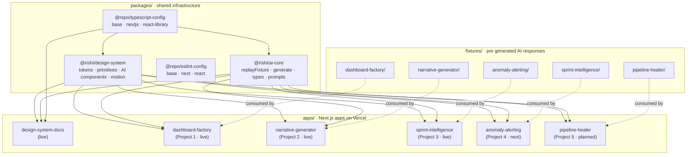

<div align="center">

# 🚀 AI Portfolio

### Five AI native applications that close the loop on the BI engineer's workflow.
**Raw data → dashboard → deck → decision.** Built on Next.js 15 and Vercel, one shared design system, a streaming AI core, and zero runtime cost.

**Rishikesh Gundla** · Senior BI Engineer moving into Data and Analytics Engineering · [rishikeshgundla.com](https://rishikeshgundla.com)


**Projects 1, 2, and 3 shipped at v1.0** · 332 of 436 tasks · Phase 4 (Anomaly Alerting) up next

</div>

---

## ▶ Live now: try them in your browser

Three shipped products, one shared engine. Every demo runs instantly. No signup, no wait, no cost.

<table>
<tr><td width="60%">

### 🟢 1 · Instant Dashboard Factory
**A raw CSV becomes a fully designed interactive dashboard in about 60 seconds.** Pick a sample dataset, watch Claude profile it live, and get KPIs, charts, filters, drill downs, and PDF export, all themed to a single design system. A second wireframe mode renders stakeholder mockups from the same engine.

</td><td valign="center">

[](https://ai-portfolio-dashboard-factory.vercel.app)

[](./docs/case-studies/dashboard-factory.md)

</td></tr>

<tr><td width="60%">

### 🟢 2 · Dashboard to Deck Narrative Generator
**The other half of the BI job: turning a dashboard into a written executive readout.** Pick a sample dashboard, watch Claude stream the narrative, and download a themed seven slide PPTX deck built server side and served from cache.

</td><td valign="center">

[](https://ai-portfolio-narrative-generator.vercel.app)

[](./docs/case-studies/narrative-generator.md)

</td></tr>

<tr><td width="60%">

### 🟢 3 · AI Sprint Intelligence
**Sprint review prep for an engineering team in five minutes.** Pick a monthly sprint, filter by assignee or ticket type, and every KPI surface plus an activity heatmap updates in lockstep. A streaming AI brief closes the page with summary, watch list, and recommendations.

</td><td valign="center">

[](https://ai-portfolio-sprint-intelligence.vercel.app)

[](./docs/case-studies/sprint-intelligence.md)

</td></tr>
</table>

> Want the building blocks? The shared **Design System** is live too: [ai-portfolio-design-system-docs.vercel.app](https://ai-portfolio-design-system-docs.vercel.app) shows every token, primitive, and AI component the five apps are built from.

---

## 🔜 Going live next

<table>
<tr><td width="60%">

### ⚪ 4 · Smart Metric Anomaly Alerting
Synthetic Pulse, RevOps, and CX time series feed a gallery of curated anomalies. Click one and a streaming AI root cause explanation appears with correlation analysis, a confidence score, and a recommended action. Vendor tools detect anomalies. This one explains why.

</td><td valign="center">


</td></tr>

<tr><td width="60%">

### ⚪ 5 · AI Pipeline Debugger and Self Healer
A gallery of curated PySpark Medallion pipeline failures (schema drift, null explosion, data skew). Pick one for a streaming diagnosis, a generated PySpark patch, and a mock Slack approve or reject flow. The signature Data Engineer project of the set.

</td><td valign="center">


</td></tr>
</table>

---

## 📌 The five projects at a glance

| # | Project | What it does | Status |
|---|---------|--------------|--------|
| 1 | [Instant Dashboard Factory](./apps/dashboard-factory/) | Sample dataset → streaming AI profiling → interactive dashboard | **🟢 Live** · [demo](https://ai-portfolio-dashboard-factory.vercel.app) · [case study](./docs/case-studies/dashboard-factory.md) |
| 2 | [Narrative Generator](./apps/narrative-generator/) | Dashboard → streaming AI readout → themed PPTX download | **🟢 Live** · [demo](https://ai-portfolio-narrative-generator.vercel.app) · [case study](./docs/case-studies/narrative-generator.md) |
| 3 | [Sprint Intelligence](./apps/sprint-intelligence/) | Monthly sprints → filterable KPI dashboard + heatmap → AI meeting brief | **🟢 Live** · [demo](https://ai-portfolio-sprint-intelligence.vercel.app) · [case study](./docs/case-studies/sprint-intelligence.md) |
| 4 | Smart Metric Anomaly Alerting | Curated anomalies → AI root cause narration with correlation analysis | 🔜 Next |
| 5 | AI Pipeline Debugger and Self Healer | PySpark failure scenarios → AI diagnosis, patch, and mock Slack approval | 🔜 Planned |
| 0 | [Design System Docs](./apps/design-system-docs/) | Live showcase of tokens, primitives, and AI components | **🟢 Live** · [demo](https://ai-portfolio-design-system-docs.vercel.app) |

Each app carries its own `README.md`, `portfolio.meta.json`, and a case study in [`docs/case-studies/`](./docs/case-studies/).

---

## 🧱 Architecture


```mermaid
flowchart TB
    subgraph packages["packages/ · shared infrastructure"]
        DS["@rishi/design-system<br/>tokens · primitives · AI components · motion"]
        AI["@rishi/ai-core<br/>replayFixture · generate · types · prompts"]
        TS["@repo/typescript-config<br/>base · nextjs · react-library"]
        EL["@repo/eslint-config<br/>base · next · react"]
    end

    subgraph apps["apps/ · Next.js apps on Vercel"]
        DSD["design-system-docs<br/>(live)"]
        P1["dashboard-factory<br/>(Project 1 · live)"]
        P2["narrative-generator<br/>(Project 2 · live)"]
        P3["sprint-intelligence<br/>(Project 3 · live)"]
        P4["anomaly-alerting<br/>(Project 4 · next)"]
        P5["pipeline-healer<br/>(Project 5 · planned)"]
    end

    subgraph data["fixtures/ · pre generated AI responses"]
        F1["dashboard-factory/"]
        F2["narrative-generator/"]
        F3["anomaly-alerting/"]
        F4["sprint-intelligence/"]
        F5["pipeline-healer/"]
    end

    DS --> DSD
    DS --> P1
    DS --> P2
    DS --> P3
    DS --> P4
    DS --> P5

    AI --> DSD
    AI --> P1
    AI --> P2
    AI --> P3
    AI --> P4
    AI --> P5

    TS --> DS
    TS --> AI
    TS --> DSD

    F1 -.consumed by.-> P1
    F2 -.consumed by.-> P2
    F3 -.consumed by.-> P3
    F4 -.consumed by.-> P4
    F5 -.consumed by.-> P5
```

### Why this shape works

- **One design system, every surface.** Every visual surface, five demo apps plus one showcase site, imports from `@rishi/design-system`. Change a token once and they all update.
- **One streaming primitive, every use case.** `@rishi/ai-core`'s `replayFixture` is the single way streaming AI output is handled across every app. Apps do not reinvent the animation. They pass a fixture and a config.
- **Fixtures sit beside code.** Pre generated AI responses live in `fixtures/` at the repo root, committed to git and reviewed as regular source files. No runtime API calls and no hidden cost.
- **Turborepo and pnpm workspaces.** Packages rebuild only when their inputs change, and Vercel deploys any app from the same monorepo by setting a different Root Directory.

---

## 📁 Repository structure

```
ai-portfolio/
├── apps/                           Next.js apps on Vercel (4 live, 2 planned)
│   ├── design-system-docs/         live: showcases all design system exports
│   ├── dashboard-factory/          Project 1 (live)
│   ├── narrative-generator/        Project 2 (live)
│   └── sprint-intelligence/        Project 3 (live)
├── packages/
│   ├── design-system/              @rishi/design-system
│   │   ├── src/tokens/             CSS variables
│   │   ├── src/primitives/         Radix backed components
│   │   ├── src/components/         AI specific composed components
│   │   └── src/motion/             Framer Motion variants
│   ├── ai-core/                    @rishi/ai-core
│   │   ├── src/replay.ts           streaming replay primitive
│   │   ├── src/generate.ts         development only Anthropic SDK wrapper
│   │   ├── src/prompts/            system prompts for all five projects
│   │   └── src/types/              Fixture, Scenario, StreamConfig
│   ├── eslint-config/              shared lint config
│   └── typescript-config/          shared tsconfig bases
├── fixtures/                       pre generated AI responses per project
├── docs/
│   ├── master-plan.md              canonical day by day plan
│   ├── plan.html                   interactive plan dashboard
│   └── case-studies/               per project case studies
├── scripts/                        portfolio and resume sync automation
└── .github/workflows/              GitHub Actions
```

---

## 🛠️ Development

```bash
pnpm install                          # install workspace dependencies
pnpm dev --filter dashboard-factory   # run one app locally
pnpm build                            # build all apps and packages
pnpm lint                             # lint across workspaces
pnpm check-types                      # tsc --noEmit across workspaces
```

Per app scripts are delegated through Turborepo. Run `pnpm --filter <app-name> <script>` to scope to a single app.

---

## 🧰 Tech stack

- **Framework**: Next.js 15.1 App Router with Turbopack
- **Language**: TypeScript 5.9 with strict mode
- **Styling**: Tailwind 3.4 with a shared preset
- **Primitives**: Radix UI
- **Motion**: Framer Motion 11 plus CSS keyframes
- **Markdown**: react-markdown plus remark-gfm
- **AI**: Vercel AI SDK plus Anthropic SDK (development only, for fixture generation)
- **Monorepo**: pnpm workspaces plus Turborepo
- **Deploy**: Vercel, one project per app

---

## ⚙️ Automation

When an app ships with `apps/<project>/portfolio.meta.json#deployedAt` populated, a GitHub Action opens pull requests on:

- [`rishigundla/portfolio-site`](https://github.com/rishigundla/portfolio-site) for a new project card and case study
- [`rishigundla/resume-builder`](https://github.com/rishigundla/resume-builder) for a new bullet under the AI projects category

See the automation section of [the master plan](./docs/master-plan.md) for the design.

---

## 📐 Conventions

- **No runtime AI calls.** Every deployed app streams pre generated fixtures, so runtime cost stays at zero dollars per month.
- **No checkbox without verification.** A task is checked only when the outcome is observable.
- **Plan markdown and plan HTML stay in sync.** Daily updates touch both `docs/master-plan.md` and `docs/plan.html`.
- **Commits are factual.** Messages state what changed and why.

---

## 📄 License

MIT. Reuse any pattern you find useful. The architecture is deliberately reusable for anyone building an AI native portfolio on Vercel.
